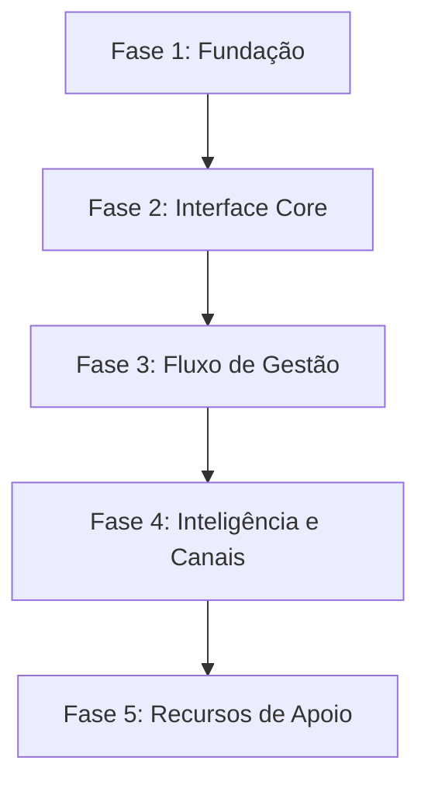

# Roadmap: IdeaFlow

**Estado Atual:** Inicialização
**Última Atualização:** 02/05/2026

## Visão Geral das Fases

---

## Detalhamento das Fases

### Fase 1: Fundação e Infraestrutura (Supabase + Auth)
**Objetivo:** Estabelecer a base técnica e segurança.
- [x] **Setup Inicial**: Configuração do projeto Vite, Tailwind v4 e Shadcn/UI.
- [x] **Supabase Setup**: Criação do projeto, tabelas (`profiles`, `ideas`, `projects`) e RLS.
- [x] **Autenticação**: Fluxo de Signup/Login (Email e Google OAuth).
- [x] **Persistência Core**: Conexão do frontend com o Supabase client.
**Entrega**: App funcional com login e proteção de rotas. ✅

### Fase 2: Interface Core (Landing Page + Dashboard)
**Objetivo:** Criar a experiência visual e navegação.
- [x] **Landing Page**: Hero impactante e seção "Como Funciona".
- [x] **Layout Base**: Header fixo e Sidebar responsiva (desktop/mobile).
- [x] **Esqueleto Visual**: Implementação de Skeletons para carregamento.
**Entrega**: Usuário logado navega entre páginas vazias mas estilizadas. ✅

### Fase 3: Fluxo de Gestão (Ideias e Projetos)
**Objetivo:** Implementar a funcionalidade central do CRM.
- [ ] **Módulo de Ideias**: Grid de ideias, modal de criação com upload de logo.
- [ ] **Módulo de Projetos**: Lista de projetos com funil de status (IDEIA -> APK).
- [ ] **Dashboard Widgets**: Cards com contadores reais vindos do banco.
- [ ] **Feedback do Usuário**: Toasts de sucesso e erro em todas as ações.
- **Entrega**: Fluxo completo de transformar uma ideia em projeto.

### Fase 4: Inteligência e Canais (IA + Social)
**Objetivo:** Adicionar valor com IA e conectividade.
- [ ] **Integração IA**: Modal de chat com Lovable AI enviando contexto do projeto.
- [ ] **Canais Sociais**: Botões de ação rápida para WhatsApp e Telegram.
- [ ] **Sugestões de IA**: Renderização formatada das respostas da IA.
- **Entrega**: Usuário recebe sugestões inteligentes sobre seus projetos.

### Fase 5: Recursos de Apoio (Ferramentas + Tutoriais)
**Objetivo:** Completar o ecossistema e sincronização externa.
- [ ] **Catálogo de Ferramentas**: Página com curadoria de ferramentas úteis.
- [ ] **Módulo de Tutoriais**: Galeria de vídeos incorporados.
- [ ] **Sincronização Externa**: Integração com Google Sheets via Edge Functions.
- **Entrega**: Produto finalizado com todos os recursos auxiliares.

---

## Marcos (Milestones)

| Milestone | Descrição | Previsão |
|-----------|-----------|----------|
| M1: Alpha | Login e Dashboard funcional | Fase 2 |
| M2: Beta | Fluxo de Ideias/Projetos completo | Fase 3 |
| M3: v1.0 | MVP Final com IA e Tutoriais | Fase 5 |

---

## Evolução do Roadmap
Este roadmap é dinâmico. Após cada fase concluída, run `/gsd-transition` para atualizar o progresso e reavaliar as prioridades.
